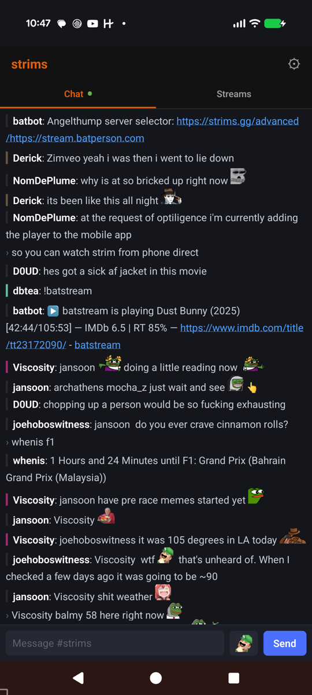
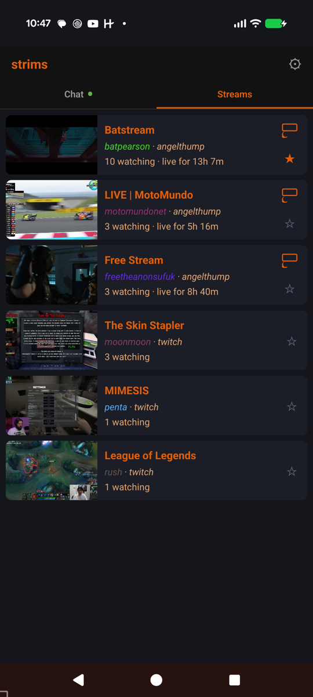
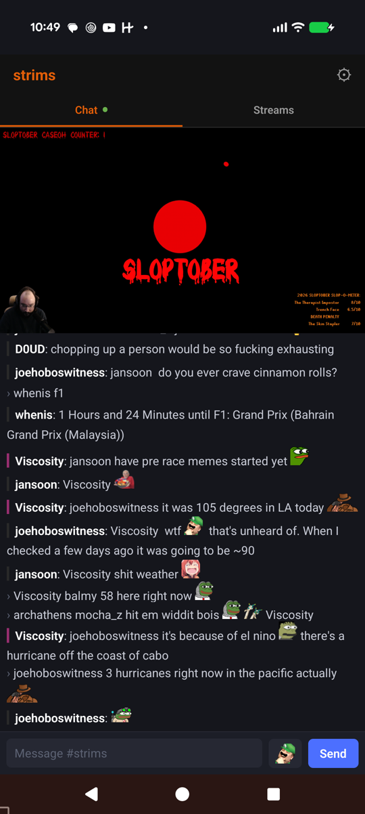
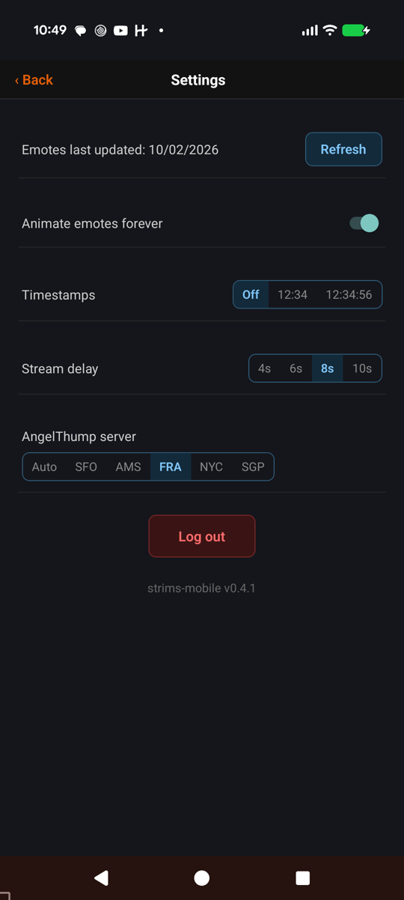
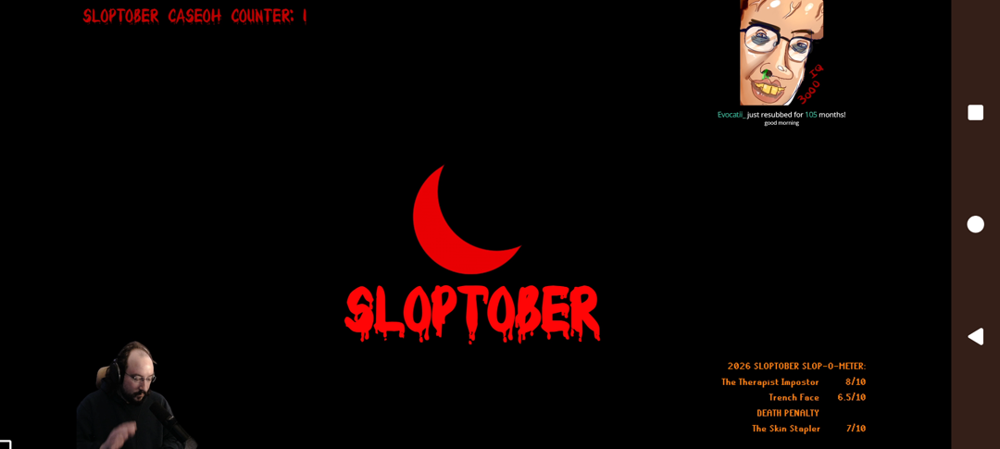

# strims-mobile

A React Native companion app for the [strims.gg](https://strims.gg) / [chat.strims.gg](https://chat.strims.gg)
community, built to match the behavior of the existing web ecosystem
([chat-gui](https://github.com/strims/chat-gui), [strims-live-extension](https://github.com/strims/strims-live-extension),
[Rustla2](https://github.com/strims/Rustla2)) rather than reinvent it: chat, the live stream list,
and AngelThump/Twitch streams playing above chat. Android-first, developed against a physical
device; iOS builds in CI on every release but hasn't been tried on an iPhone yet (see
[docs/gotchas.md](docs/gotchas.md)). Not published to the App Store or Play Store.

## Screenshots

| Chat | Streams | Watching | Settings |
| --- | --- | --- | --- |
|  |  |  |  |

Turn the phone sideways while a stream is playing for fullscreen:



## Install

Every [release](https://github.com/MemeLabs/strims-mobile/releases/latest) has an Android APK
(`app-release.apk`) and an unsigned iOS build (`StrimsMobile-unsigned.ipa`).

### Android

1. On your phone, open the [latest release](https://github.com/MemeLabs/strims-mobile/releases/latest)
   and tap `app-release.apk` to download it.
2. Open the download and tap **Install**. Android asks once to allow installs from your browser
   or Files app; allow it.
3. Tap through the "unknown developer" warning: the APK is debug-signed, not Play Store-signed.

Updates: the app checks for a new release once a day and offers to install it. Installing a new
APK over the old one keeps your login and settings.

### iOS (sideload)

The `.ipa` isn't signed, so iOS won't install it as-is. A sideloading tool re-signs it with your
own Apple ID while installing:

| Tool | Runs on | Notes |
| --- | --- | --- |
| [AltStore](https://altstore.io) | macOS / Windows (with AltServer) | Re-signs automatically every few days over Wi-Fi |
| [Sideloadly](https://sideloadly.io) | macOS / Windows | One-shot install; re-run it before the signature expires |

With AltStore:
1. Install AltServer on your Mac or PC, and AltStore on your iPhone from it.
2. Download `StrimsMobile-unsigned.ipa` from the latest release onto the iPhone.
3. In AltStore, tap **+**, pick the `.ipa`, and sign in with your Apple ID when asked.

Limits Apple puts on this: with a free Apple ID the app stops opening after 7 days unless
re-signed (AltStore does it for you while AltServer is reachable), and at most 3 sideloaded apps
can be installed at once. A paid Apple Developer account extends the 7 days to a year.

## What it does

**Chat tab** — a full chat.strims.gg client:
- Logs in through strims.gg's existing Twitch OAuth flow via an in-app WebView (no app-side
  credential handling — same login path as the website), storing the resulting `jwt` in the OS
  keychain.
- Catches up on missed messages via REST (`/api/chat/history`, `/api/chat/me`,
  `/api/chat/viewer-states`) on open/foreground/reconnect, retrying history until it lands, then
  opens the chat websocket and applies live `MSG` events on top, with the same reconnect/backoff
  behavior as chat-gui. Connection status banner (Reconnecting… / Disconnected + Retry) and a
  connected dot on the Chat tab.
- Renders chat-gui's emote set faithfully, including CSS-spritesheet "animated" emotes (e.g.
  NODDERS, catJAM), played natively as animated WebP on Android, and a subset of chat-gui's emote modifiers
  (`:mirror`, `:flip`, `:smol`, `:wide`, `:spin`, `:fast`, `:slow`, `:reverse`, `:pause`) — see
  [docs/emotes.md](docs/emotes.md).
- URL rewriting matches chat-gui's `UrlFormatter` (strims.gg/youtube/twitch/etc links shown in
  their short `service/id` form, tracking params stripped from Amazon/Twitter/Spotify links).
- Per-viewer nick coloring by watched channel (same deterministic scheme as chat-gui's viewer-state
  bar), a tap-to-focus mode that dims every other message, and a long-press nick menu: the stream
  they're watching (tap to open), mention, whisper (`/w` is sent as a real whisper), highlight,
  custom name color, and ignore (managed in Settings).
- Optional message timestamps (Settings: off / `HH:MM` / `HH:MM:SS`).
- Mention highlighting, greentext, message combos (repeated single-emote spam collapses into an
  "xN" row), "more messages" catch-up pill, and keyboard-safe layout on edge-to-edge Android.

**Streams tab** — a native client for Rustla2's aggregated stream list:
- Live stream list sorted by rustlers (strims-side viewer count), with follow/notify support
  (local notifications via Notifee when a followed channel goes live, polling on the same cadence
  as strims-live-extension).
- Channel names are colored with the same deterministic per-channel scheme used in chat, so you
  can see at a glance what color a streamer's nick will be while they're watching.
- Tap an AngelThump or Twitch stream to watch it above chat; turn the phone sideways for
  fullscreen. It shows as your viewer state in chat, same as watching on strims.gg. Other services
  (or a long-press) open the stream on strims.gg. The AngelThump player has a cast button, and its
  delay behind live and server are in Settings.
- Chromecast support for AngelThump streams (resolves past AngelThump's CORS-blocked master
  manifest to a castable edge URL; see [docs/architecture.md](docs/architecture.md)).

**Settings** — the gear in the title bar: refresh emotes, animate emotes forever, timestamps,
stream delay and AngelThump server for the player, ignored users, log out.

## Building from source

### Prerequisites (both platforms)

```sh
npm install
```

### Android

Requires the Android SDK and a running emulator or a physical device (USB debugging enabled, or
via `usbipd-win` if developing from WSL2 against a Windows-attached device).

```sh
npm run android    # builds, installs, and launches on the connected device/emulator
npm start           # Metro bundler, if not started automatically
```

### iOS

Requires Xcode and CocoaPods.

```sh
cd ios && bundle install && bundle exec pod install && cd ..
npm run ios
```

## Configuration

`src/config/env.ts` holds the API/websocket/login/Rustla URLs, defaulted to the production
strims.gg deployment. Edit that file if pointing the app at a self-hosted instance.

## Development docs

- [docs/local-dev.md](docs/local-dev.md) — day-to-day dev/test loop, including connecting a
  physical Android device from WSL2 via `usbipd-win`.
- [docs/architecture.md](docs/architecture.md) — module layout and how the major features
  (chat sync, streams/cast, emotes) fit together.
- [docs/emotes.md](docs/emotes.md) — the animated-emote crop pipeline and modifier system.
- [docs/gotchas.md](docs/gotchas.md) — RN/Android-specific pitfalls hit during development, and
  how to avoid re-hitting them.
- [docs/releasing.md](docs/releasing.md) — versioning, changelog, and how to cut a tagged
  GitHub Release. See also [CHANGELOG.md](CHANGELOG.md).
